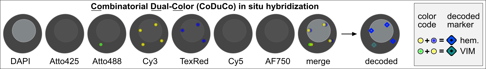
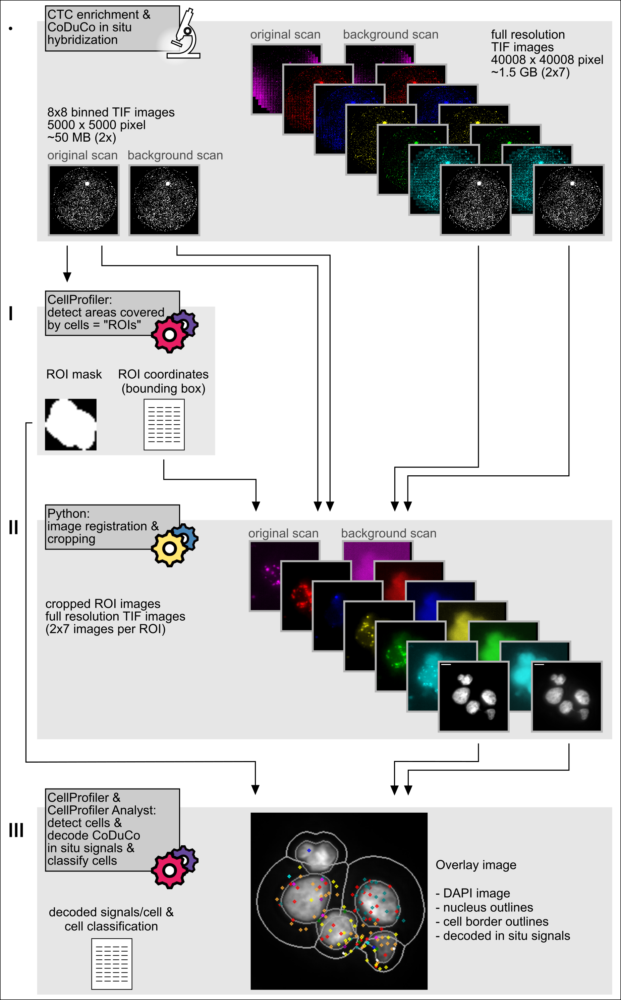

# CTC_CoDuCo  

The Combinatorial Dual-Color (CoDuCo) in situ padlock probe hybridization technique allows for the visualization of transcripts within cells. This method employs up to 15 unique dual-color codes to differentiate between transcripts, facilitating the identification and characterization of rare cells, such as circulating tumor cells (CTCs). 

This repository contains the tools for CoDuCo image analysis and CTC classification:  
I....CellProfiler pipeline to identify ROIs   
II...Python scripts for image registration and cropping   
III..CellProfiler pipeline and classifier model to decode CoDuCo in situ signals and identify CTCs  
---

## Prerequisites
This project is compatible with Python 3.8. Required Python packages are listed in the “requirements.txt” file.  
The CellProfiler pipelines were created for CellProfiler version 4.2.4.
---
## CoDuCo image analysis and CTC classification
### Input images  
Samples are scanned on a 7-channel fluorescence microscope with a 40x objective.  The “original scan” displays CoDuCo in situ stained samples, while the “background scan”, captured after removing the in situ signals, exclusively represents the samples’ autofluorescence. Images are exported in full resolution and with 8x8 binning.   
Input images can be shared on reasonable request.

### I. Identify ROIs
Run the CellProfiler pipeline `I_CellProfiler_identify_ROIs/identify_ROIs.cpproj`  
- The 8x8 binned original scan DAPI image is segmented to detect regions of interests (ROIs), i.e. regions that are occupied by nuclei.  

- Output:
  - coordinates of ROI bounding boxes (csv file)
  - cropped binary image of each ROI (tiff files)

### II. Image registration and cropping full resolution ROI images
Run the Python script `main.py`  
- The Python package pyStackReg is used to align original and background images. In pre-alignment, a rigid body transformation matrix is computed for the 8x8 binned DAPI images, multiplied by 8 for upscaling, and applied to register the full-resolution background image.
- ROIs are cropped from these full-resolution images using coordinates of ROI bounding boxes from CellProfiler. 
- For optimal alignment, rigid body registration, based on the DAPI channel, is repeated for each cropped full-resolution ROI image.

- Output:
  - cropped and aligned full resolution images of each ROI (tiff files)

### III. CoDuCo in situ signal decoding and cell classification 
Run the CellProfiler pipeline `III_CellProfiler_decoding_classification/decoding_classification.cpproj`    
The cropped full resolution images and the binary ROI images are subjected to a second CellProfiler pipeline for cell segmentation, in situ signal detection and decoding, and cell classification. 
- For all channels except DAPI, the background scan is subtracted from the original scan to decrease autofluorescence, thereby increasing the relative intensity of in situ signals. 
- The binary ROI image is used to mask the DAPI image to remove nuclei of neighboring ROIs with overlapping bounding boxes. 
- Nuclei are detected using Otsu image segmentation and cell borders are defined by expanding nuclei.	
- In situ signals are identified using adaptive minimum cross-entropy thresholding. 	
- For in situ signal decoding, the “Relate Objects” module is deployed for each utilized dual-color code to identify colocalized signals. 	
- Potential false-positive in situ signals, due to high in situ signal density or high autofluorescence, are masked by additional CellProfiler modules.	
- The “RelateObjects” module is used to assign the decoded in situ signals to appointed cells. 	
- Cells are classified based on their in situ signal counts using a random forest model trained on control samples in CellProfiler Analyst.	   
  

- Output: 	
  - class and in situ signal count for each cell (csv file)
  - visualized results displaying decoded in situ signals on the DAPI image (tiff files)

